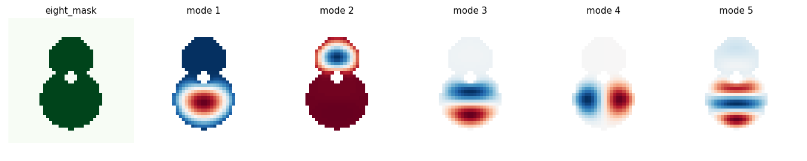

# RealSound

**A physics-first musical-instrument synthesizer, built from first principles in Python.**

RealSound makes sound by simulating the mechanics that produce it — a vibrating
string, a stiff wooden plate, the air trapped in a body cavity — rather than by
sampling a real instrument or stacking sine waves. The bet behind the project: if
the physics is right, the *timbre* is right, including behaviours nobody explicitly
programmed. That emergent correctness is the whole reason to model physically
instead of faking the output.

The first complete instrument is an acoustic guitar, assembled one physical idea at
a time — from a plucked string, through the plate that forms its top, to the
coupling that turns a plate and a string into an instrument. The same machinery also
plays deliberately *impossible* instruments (bodies and materials that could not
exist), which is half the fun of owning the physics.

---

## What works today

The validated backend (`realsound.py`) is a small library of pure functions, each a
single piece of acoustics you can test on its own:

- **String** — a Karplus–Strong / digital-waveguide plucked string with
  *fractional-delay tuning*, accurate to under half a cent. Pluck position and loop
  gain are real physical controls (where you pick, how fast it decays).
- **Plate body** — an orthotropic (grain-aware) finite-difference plate solved for
  its modes, either as a square or as an **arbitrary body shape** defined by a
  boolean mask. This is what makes the plate behave like *wood* rather than metal.
- **Air cavity** — a three-oscillator coupled model of top plate, back plate, and
  the soundhole air slug (the guitar's "breathing" Helmholtz resonance).
- **Modal synthesis** — a bank of decaying sinusoids and a full body impulse
  response (`build_body_IR`) assembled from the plate modes, with strike/listen
  points.
- **Sequencing** — an overlap-add voice layer that plays any instrument function
  through a scale.
- **Analysis** — a sub-sample-accurate pitch estimator for validating renders.

`guitar.ipynb` is the lab where new physics is prototyped and heard before it
graduates into `realsound.py`. The full technical write-up of how the guitar was
built lives in [`docs/RealSound_Guitar_Report.md`](docs/RealSound_Guitar_Report.md);
the project charter and roadmap are in [`docs/PROJECT_GUIDE.md`](docs/PROJECT_GUIDE.md).

### The guitar top, seen and heard



*The vibration modes of a guitar-shaped orthotropic plate, solved from its geometry.*
Listen to a body render: [`assets/AB_guitar_shape.wav`](assets/AB_guitar_shape.wav).

---

## The long-term vision

RealSound is meant to grow into an interactive application where you can pick or
build an instrument, morph it continuously (change the bore, the shape, the
material), *see* what is happening (waveform, spectrum, standing waves, mode
shapes), and eventually shape a **human voice** through a modeled vocal tract.
Instruments would export as DAW-ready samples. It is also a teaching instrument:
every control maps to a real physical quantity, so playing with it teaches
acoustics.

---

## Getting started

```bash
git clone <your-repo-url>
cd RealSound
python -m venv .venv && source .venv/bin/activate   # Windows: .venv\Scripts\activate
pip install -r requirements.txt
```

Developed on **Python 3.10**. Dependencies are just `numpy`, `scipy`, and
`matplotlib` (see [`requirements.txt`](requirements.txt)).

### Use the backend module

```python
from realsound import pluck_string, plate_from_mask, boolean_8_grid

# A plucked string at 220 Hz, picked a fifth of the way along, 2 s long
note = pluck_string(f=220, beta=0.2, duration=2.0, rho=0.999)

# Solve a guitar-shaped plate for its modes
mask = boolean_8_grid()                       # figure-8 body outline + soundhole
evals, evecs, idx = plate_from_mask(mask)     # idx maps grid cells -> mode-matrix rows
```

Write audio to disk with `scipy.io.wavfile.write("note.wav", 44100, note)`.

### Run the notebook

```bash
pip install jupyter ipython   # if not already installed
jupyter notebook notebooks/guitar.ipynb
```

The notebook uses `IPython.display.Audio` to play results inline.

### Run the instrument UI

`app/instrument_ui.py` is an interactive **Gradio** app that renders instruments and
figures headlessly (matplotlib's `Agg` backend) and can package renders for export.

```bash
pip install gradio
python app/instrument_ui.py
```

---
## Status & honesty note

This is an active research project. The models carry approximations and they are
stated plainly rather than hidden — the discretization error in the plate spectrum,
the specially-orthotropic idealization of the wood, and the one-way nature of the
string-to-body coupling are all documented where they arise (see the guitar report).
Correctness from first principles is the point.
